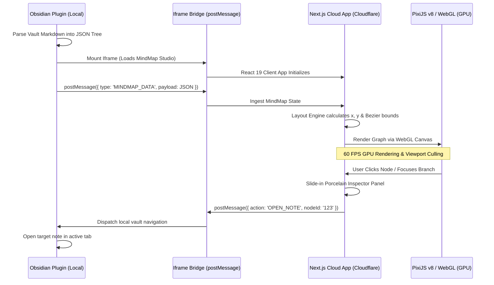

<div align="center">
  <h1>🧠 MindMap Studio (Cloud App)</h1>
  <p>A high-performance, WebGL-accelerated Next.js 15 application for interactive, large-scale mind map visualization.</p>
  <p>
    <a href="#-features">Features</a> •
    <a href="#-architecture">Architecture</a> •
    <a href="#-design-system">Design System</a> •
    <a href="#-quick-start">Quick Start</a> •
    <a href="#-obsidian-bridge-protocol">Obsidian Protocol</a>
  </p>
</div>

---

## 📖 Overview

**MindMap Studio** is a Cloudflare-ready, Next.js 15 WebGL application designed to render complex, multi-thousand-node Markdown mind maps with silky-smooth 60 FPS performance.

This project is the **Cloud & Visualization Engine** of the Obsidian MindMap ecosystem. It works seamlessly with the [Obsidian MindMap Bridge Plugin](https://github.com/naksh-07/obsidian-mindmap-bridge) to deliver hardware-accelerated interactive graph visualization directly inside your Obsidian vault without consuming Electron's main memory or lagging the local editor.

---

## ✨ Features

- **⚡ Hardware-Accelerated 60 FPS WebGL Engine**: Powered by **PixiJS v8** and `pixi-viewport`. Replaced heavy HTML DOM nodes (`<div>`) with hardware GPU containers, multi-layer drop shadows, and smooth cubic Bezier splines.
- **🔎 3.5× Retina Super-Sampled Typography**: Renders Hindi (Devanagari) and English text at `3.5×` supersampled texture resolution (`roundPixels: true`, `2.5×` renderer DPR) so deep zoom stays 100% razor-sharp with zero pixelation.
- **🎨 Clean Zero-Dot Studio Surface (Google Stitch)**: Smooth radial studio canvas (`.canvas-stage`: `#F8FAFC → #EEF2F6` in Light mode, `#111827 → #080C14` in Dark mode) with zero dot-grid visual noise. Elevated `#FFFFFF` cards pop via 2-layer tactile shadows and `4px` branch-colored left accent bars.
- **📱 Mobile-First Progressive 2-Column UX (`< 768px`)**:
  - Automatically defaults to a readable 2-column **Tree (`horizontal`)** overview with Level-1 branches initially collapsed (`+2` / `+3` colored pill badges) at `~0.75×` zoom instead of shrinking the whole graph into microscopic nodes.
  - **Smart Camera Auto-Focus (`frameNodeSubset`)**: Tapping any `+N` badge expands that branch and smoothly animates the camera to frame `[Branch + Newly Expanded Sub-Nodes]`.
  - **Floating Mobile Thumb Control Dock**: One-thumb access to Zoom In (`+`), Zoom Out (`–`), Fit to Screen, Expand/Collapse All, quick layout switching (`Tree | Balanced | Vertical`), and a swipe-friendly **Mobile Bottom Sheet Inspector**.
- **🎯 Viewport Culling & Multi-Touch Guards**: Automatically culls off-screen nodes and prevents accidental node selection during two-finger pinch-to-zoom gestures.
- **🔍 Instant Search & Auto-Expansion (`⌘K`)**: Fast client-side search across node labels, subtitles, descriptions, and key facts—automatically expanding collapsed parent branches when a hidden child matches.
- **📐 Multiple Layout Algorithms**:
  - **Balanced (Two-way Tree)**: Root centered, branches distributed left and right.
  - **Tree (Left-to-Right)**: Clean hierarchical outline flow.
  - **Vertical (Top-to-Bottom)**: Downward organizational structure.
- **🧠 Active Recall Study Mode**: Transforms the mind map into an interactive flashcard memory trainer by masking node titles behind tap-to-reveal pills.
- **📋 Porcelain Inspector &Mobile Bottom Sheet**:
  - Detailed concept notes, syllabus summaries, and High-Yield key facts checkpoints.
  - 2×2 Node Attributes Grid & SVG Retention Progress Ring.
- **🔗 Bi-directional Obsidian Bridge**:
  - Prominent **Obsidian में खोलें (Open in Obsidian)** action button with `<kbd>⌘↵</kbd>` shortcut.
  - Communicates with the local Obsidian host via secure `window.parent.postMessage`.
- **📊 Real-time Telemetry HUD**: Persistent bottom HUD reporting total/visible nodes, 60 FPS WebGL status, and clickable lineage breadcrumbs.

---

## 🏗️ Architecture



---

## 🎨 Design System

Designed and synced using **Google Stitch**, adhering to modern architectural minimalism:

| Token | Light Theme | Dark Theme | Purpose |
|---|---|---|---|
| **Canvas Stage (`.canvas-stage`)** | `#F8FAFC → #EEF2F6` (Smooth Radial) | `#111827 → #080C14` (Midnight Radial) | Zero-dot, zero-noise studio surface |
| **Node Surface** | `#FFFFFF` (Pure Porcelain) | `#1E293B` (Slate Tectonic) | Elevated node cards & inspector |
| **Card Elevation** | `2-Layer Soft Shadow + 4px Branch Bar` | `2-Layer Dark Shadow + 4px Branch Bar` | Tactile card separation & visual hierarchy |
| **Primary Accent** | `#2563EB` (Ceramic Cobalt) | `#3B82F6` (Electric Azure) | Selection ring, badges & brand |
| **Active Recall** | `#D97706` (Warm Amber) | `#F59E0B` (Amber Flame) | Study recall mode & badges |
| **Typography** | Geist Sans / Noto Sans Devanagari (`3.5×` Retina) | Same | Razor-sharp legibility in Hindi & English |

---

## 💻 Quick Start

### Prerequisites
- Node.js (v18+)
- npm or pnpm

### Running Locally

1. **Clone & Install Dependencies:**
   ```bash
   git clone https://github.com/naksh-07/mindmap.git
   cd mindmap
   npm install
   ```

2. **Run Development Server:**
   ```bash
   npm run dev
   ```
   Open [http://localhost:3000](http://localhost:3000) to view the application.

3. **Build Static Export & Deploy to Cloudflare:**
   ```bash
   npm run build
   npx wrangler deploy
   ```
   To preview the static export locally before deploying:
   ```bash
   npx serve out -l 3005
   ```

---

## 🧪 Included Datasets

The app includes bundled sample datasets ready for instant exploration:
- **UPSC Modern Indian History (`/example-mindmap.json`)**: 15 nodes covering 1857 to 1947, 4 eras, high-yield checkpoints, and embedded MCQs.
- **India Physical Geography**: 15 nodes covering Himalayas, Peninsular Plateau, River systems, and Coastal Plains.
- **Stress-Test Benchmarks**: Synthetic 20, 50, 100, 200, 500, and 1,000 node trees for GPU benchmark profiling.

---

## 🔌 Obsidian Bridge Protocol

When embedded inside an Obsidian iframe, MindMap Studio communicates via `postMessage`:

### 1. Ingesting Vault MindMap (`Obsidian -> WebApp`):
```json
{
  "type": "MINDMAP_DATA",
  "payload": {
    "title": "My Note Graph",
    "root": {
      "id": "root-1",
      "label": "Central Concept",
      "children": [...]
    }
  }
}
```

### 2. Opening Note in Obsidian (`WebApp -> Obsidian`):
```json
{
  "action": "OPEN_NOTE",
  "nodeId": "History/1857-Revolt.md"
}
```

---

## 📄 License

This project is open-source under the [MIT License](LICENSE).
