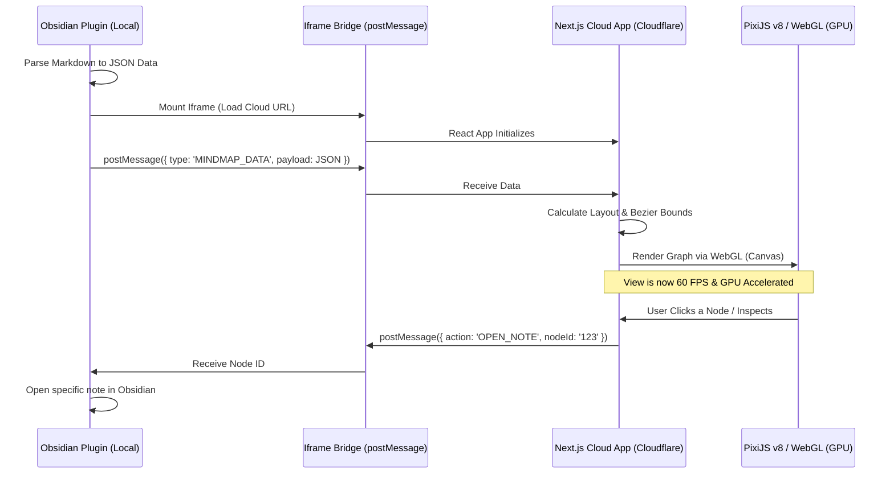

# Mind Map WebGL Migration Plan & Execution Log

This document outlines the strategic architectural update to transition the Mind Map viewer from a DOM-based rendering system to a high-performance WebGL solution using PixiJS. 

> **Important:** The primary requirement is that the view must operate flawlessly **inside the Obsidian Extension** as an iframe, ensuring a seamless user experience while maintaining ease of development.

## 🎯 The "Why"
Obsidian is built on Electron. Injecting an iframe that renders 2,000+ HTML `
` elements using React/Next.js will bottleneck Obsidian’s main memory thread, causing noticeable lag and app degradation. 

By utilizing **PixiJS (WebGL)**, the Next.js app will leverage the user's GPU instead. This keeps Obsidian's memory footprint light, ensuring the mind map glides at a buttery 60 FPS. Best of all, this avoids the steep learning curve of migrating to Rust or Svelte; we retain our current Next.js environment and layout engine.

## 🏗️ Architecture Flow

---

## ☁️ Phase 1: Cloud App Updates (Next.js) — [COMPLETED ✅]

The Cloudflare Next.js application has successfully transitioned from an HTML renderer to a Canvas/Game Engine renderer.

### 1. Deprecate DOM Elements — [DONE ✅]
- **Action:** Deleted `components/mindmap/MindMapNodeCard.tsx` and legacy DOM canvas `MindMapCanvas.tsx`.
- **Outcome:** Zero HTML `
` nodes on canvas; GPU renders all nodes as PixiJS containers.

### 2. Integrate PixiJS v8 — [DONE ✅]
- **Action:** Installed `pixi.js` and `pixi-viewport`.
- **Implementation:** Created [`components/mindmap/MindMapWebGLCanvas.tsx`](file:///c:/Users/Suraj/Downloads/mind-map/components/mindmap/MindMapWebGLCanvas.tsx).
- **Outcome:** Asynchronous WebGL initialization with React lifecycle synchronization (`isPixiReady`).

### 3. Canvas Drawing & Bezier Splines — [DONE ✅]
- **Nodes:** PixiJS `Graphics` rounded rectangles with Ceramic Cobalt selection glow and level-coded accent badges.
- **Connectors:** Smooth cubic Bezier curves (`bezierCurveTo`) with level-matched theme palettes and smooth alphas.
- **Text:** High-DPI PixiJS `Text` sprites supporting Hindi/Devanagari and Geist typography.

### 4. Viewport Culling & Interaction — [DONE ✅]
- **Action:** Integrated `pixi-viewport` with world-to-screen coordinate mapping.
- **Benefit:** Nodes outside the current viewport are culled from rendering loops.
- **Hit-Testing:** Spatial hit-testing engine intercepts node clicks, branch collapse toggles, and Active Recall reveals.

### 5. Bi-directional Bridge (Obsidian Deep-Link) — [DONE ✅]
- **Action:** Wired `MindMapNodeDetailPanel.tsx` with "Obsidian में खोलें" action button and `<kbd>⌘↵</kbd>` shortcut.
- **Action:** Dispatches `window.parent.postMessage({ action: 'OPEN_NOTE', nodeId: node.id }, '*')`.

### 6. Google Stitch Modern Minimal UI — [DONE ✅]
- **Theme:** Clean zero-dot studio surface (`.canvas-stage` smooth radial gradient `#F8FAFC → #EEF2F6`), Pure Porcelain (`#FFFFFF`) elevated cards with 2-layer drop shadows and `4px` branch-colored left accent bars.
- **Studio Header:** Integrated search (`⌘K`), dataset switcher, layout switcher (Balanced, Tree, Vertical), viewport action dock, Active Recall mode, and Quiz modal.
- **Inspector Panel:** Right-docked porcelain sheet on desktop and swipe-friendly Bottom Sheet (`max-h-[75vh] rounded-t-2xl`) on mobile with 2×2 attributes grid, concept summaries, high-yield checkpoints, and SVG SRS retention ring.

### 7. 3.5× Retina Text & Mobile-First Progressive UX — [DONE ✅]
- **Zero Blur on Zoom:** Super-sampled PixiJS `Text` at `TEXT_RESOLUTION = 3.5` with `roundPixels: true` and `2.5×` renderer DPR.
- **Mobile 2-Column Progressive Default (`< 768px`):** Automatically opens in `Tree (horizontal)` mode with Level-1 branches collapsed (`+2`/`+3` colored pill badges) so cards render at `~0.75×` readable scale on phone screens.
- **Smart Camera Auto-Focus (`frameNodeSubset`):** Tapping `+N` on any branch expands its children and smoothly animates the camera to frame `[Branch + Expanded Children]`.
- **Floating Mobile Thumb Dock:** Added right-side thumb controls (`+`, `–`, `Fit`, `Expand/Collapse All`) and top quick layout pill bar (`Tree | Balanced | Vertical`).

---

## 🔌 Phase 2: Viewer Extension Updates (Obsidian Plugin) — [PLANNED 📋]

The Obsidian plugin will act solely as a "Controller" and Data Parser, delegating all heavy lifting to the cloud iframe.

### 1. Iframe Container Setup
- **Action:** Implement an `ItemView` inside the Obsidian plugin that wraps an HTML `<iframe>`.
- **Target URL:** Point the iframe `src` to the Cloudflare Pages deployment (e.g., `https://mindmap.naksh.pages.dev`).

### 2. Markdown to JSON Engine
- **Action:** Maintain and optimize the local parser.
- **Function:** Read Markdown notes, extract internal links and tags, and serialize the data into the `.mindmap.json` structure expected by the Next.js app.

### 3. Local-to-Cloud Data Transfer
- **Action:** Hook into the iframe's `onload` event.
- **Function:** Dispatch `iframe.contentWindow.postMessage({ type: 'MINDMAP_DATA', payload: jsonPayload }, '*')`.
- **Benefit:** Fast, secure, entirely local transfer. No need to upload Vault data to external databases.

### 4. Intercept & Navigate
- **Action:** Add a global listener: `window.addEventListener('message', handler)`.
- **Function:** Detect incoming messages containing `{ action: "OPEN_NOTE", nodeId: "file.md" }`.
- **Action:** Utilize the Obsidian API (`app.workspace.openLinkText(nodeId, '')`) to instantly navigate to the requested note.
